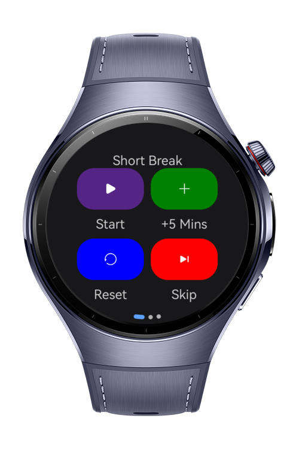
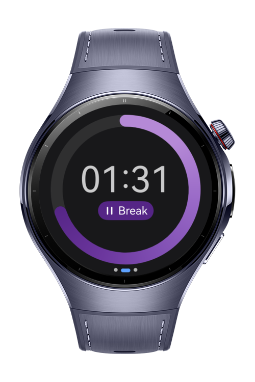
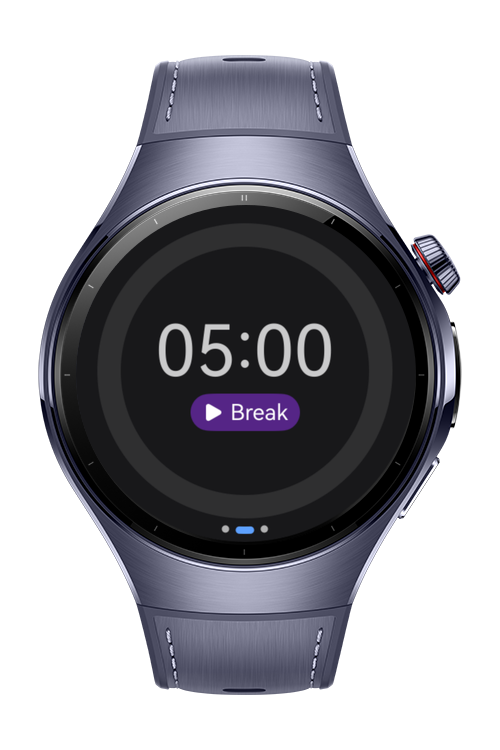
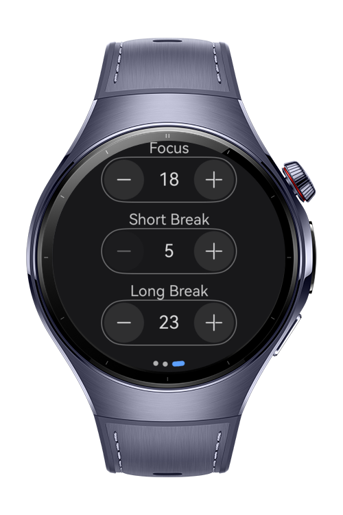

> **Note:** To access all shared projects, get information about environment setup, and view other guides, please visit [Explore-In-HMOS-Wearable Index](https://github.com/Explore-In-HMOS-Wearable/hmos-index).

# Sample Focus Timer

Focus Timer app helps users to stay focused and productive by using timed work intervals with short and long breaks. It
is based on the Pomodoro Technique.

# Preview

<div>
    
    
    
    
</div>

# Use Cases

Focus Timer provides the best way to stay focused with short and long breaks based on the Pomodoro Technique.

### Controller

- Controller is the first page of the application. It is used to control the active focus session. You can start, stop or reset the active session or skip the next one.

### Timer

- Track the active focus session.

### Settings

- Set default times for focus sessions.

# Tech Stack

- **Languages**: ArkTS, ArkUI
- **Frameworks**: HarmonyOS SDK 5.0.2(14)
- **Tools**: DevEco Studio Vers 5.1.0.820
- **Libraries**: @kit.ArkUI

# Directory Structure

```
entry/src/main/ets/
├───components                           
│       ProgressController.ets           
│       ProgressRing.ets                 
│       ProgressTimes.ets                
├───entryability                         
│       EntryAbility.ets                 
├───entrybackupability                   
│       EntryBackupAbility.ets                                   
├───model
│       Focus.ets
│       FocusType.ets
│       Program.ets
│       Timer.ets
└───pages
        Index.ets
```

# Constraints and Restrictions
## Supported Device
- Huawei Watch 5

# LICENSE
**Sample Focus Timer** is distributed under the terms of the MIT License.
See the [license](LICENSE) for more information. 